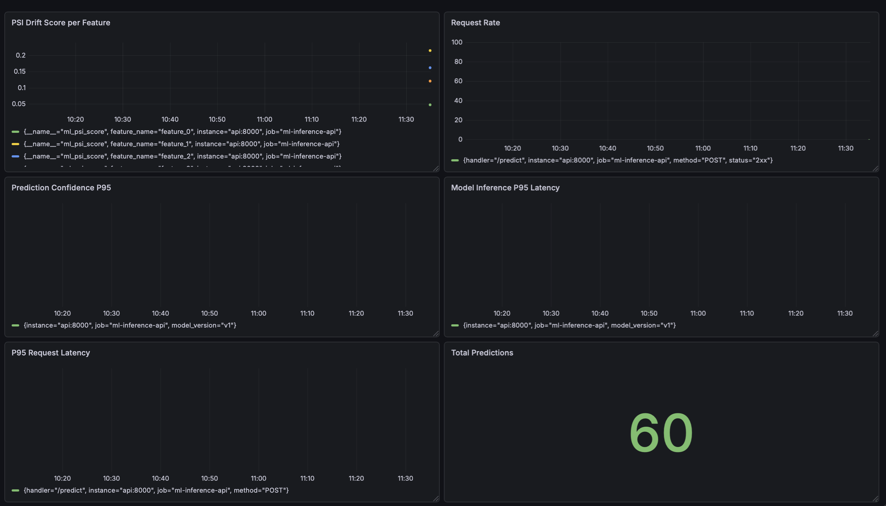
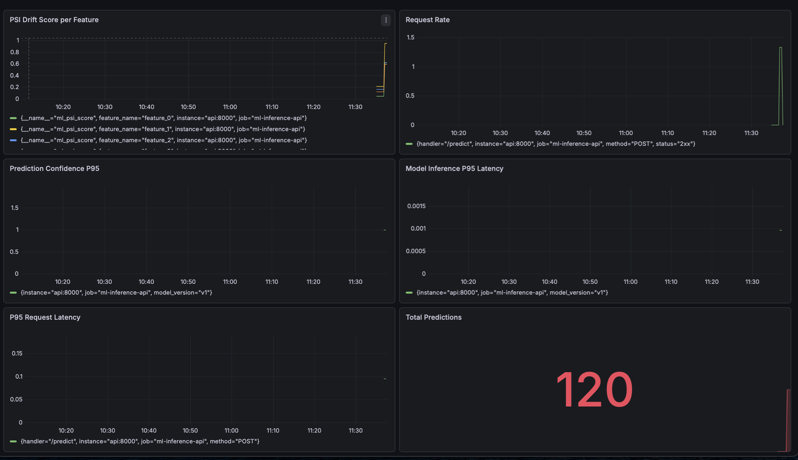

# ML Inference Platform


A production-style ML inference platform built to explore ML systems engineering. Two ONNX models are served through a FastAPI app with observability, drift detection, shadow mode testing, canary routing, and automated rollback all running locally via Docker Compose. The models (Iris classifiers using RandomForest + GradientBoosting Classifiers and a MiniLM embedder) are intentionally simple. The main focus was the infrastructure and pipeline itself rather than the models.

---

## Architecture Overview

The platform serves two inference endpoints backed by ONNX Runtime. The tabular endpoint (`/predict`) routes requests through a canary router that sends 10% of traffic to a shadow v2 model (GradientBoosting) while the remaining 90% goes to the stable v1 model (RandomForest). Both models run in the same process, loaded at startup. The text endpoint (`/predict/text`) runs `sentence-transformers/all-MiniLM-L6-v2` exported to ONNX via HuggingFace Optimum, performing mean-pooled, L2-normalised embedding inference entirely in NumPy without a PyTorch dependency at runtime.

A background scheduler runs every 60 seconds and does three things: PSI drift detection on a rolling window of tabular features against the training distribution, cosine similarity drift detection on text embeddings against a reference set built from the first 50 requests, and a rollback check that reverts canary traffic if v1/v2 prediction divergence exceeds 15%.

Prometheus scrapes `/metrics` every 15 seconds. Seven custom metrics are exposed alongside the auto-instrumented HTTP metrics from `prometheus-fastapi-instrumentator`. Grafana is provisioned automatically with a 9-panel dashboard. Four alert rules cover PSI drift, embedding drift, P95 latency, and error rate.

```
                        ┌─────────────────────────────────────────┐
                        │              FastAPI (port 8000)         │
                        │                                          │
  HTTP Request ────────►│  Canary Router (10% → v2, 90% → v1)    │
                        │       │                  │               │
                        │  ONNX v1 (RF)      ONNX v2 (GB)         │
                        │  [tabular]         [shadow mode]         │
                        │                                          │
                        │  ONNX MiniLM (text embeddings)          │
                        │                                          │
                        │  Background Scheduler (60s interval)     │
                        │  ├── PSI drift check                     │
                        │  ├── Embedding drift check               │
                        │  └── Divergence → rollback check         │
                        └──────────────┬──────────────────────────┘
                                       │ /metrics
                                       ▼
                              Prometheus (port 9090)
                                       │
                                       ▼
                               Grafana (port 3000)
```

---

## Tech Stack

| Component | Technology |
|-----------|-----------|
| API framework | FastAPI |
| Model runtime | ONNX Runtime |
| Tabular models | scikit-learn (RandomForest, GradientBoosting) |
| Text model | sentence-transformers/all-MiniLM-L6-v2 via HuggingFace Optimum |
| Model export | skl2onnx, HuggingFace Optimum |
| Metrics | Prometheus + prometheus-fastapi-instrumentator |
| Dashboards | Grafana (auto-provisioned) |
| Containerisation | Docker Compose |
| CI | GitHub Actions |
| Load testing | Locust |
| Unit testing | pytest |
| Cache / queue | Redis (provisioned, reserved for async job queue) |

---

## Services

| Service | URL | Description |
|---------|-----|-------------|
| API | http://localhost:8000 | Inference endpoints |
| API Docs | http://localhost:8000/docs | Interactive Swagger UI |
| Metrics | http://localhost:8000/metrics | Raw Prometheus metrics |
| Prometheus | http://localhost:9090 | Query and alert state |
| Grafana | http://localhost:3000 | Dashboard (admin / admin) |
| Locust | http://localhost:8089 | Load test UI (run `locust -f locust/locustfile.py --host http://localhost:8000`) |

---

## Quickstart

**Prerequisites:** Docker, Docker Compose, Python 3.10

### 1. Clone the repository

```bash
git clone https://github.com/ammarhassona/ml-inference-platform.git
cd ml-inference-platform
```

### 2. Create a virtual environment and install dependencies

**With pip:**

```bash
python -m venv .venv
source .venv/bin/activate  # Windows: .venv\Scripts\activate
pip install -r requirements.txt
```

**With uv (faster):**

```bash
curl -LsSf https://astral.sh/uv/install.sh | sh
uv sync
```

`uv sync` reads `pyproject.toml` and creates the virtual environment automatically.

### 3. Export models

These scripts train the classifiers on the Iris dataset and export them to ONNX, then download and export MiniLM to ONNX. Run both from the project root. The `model_artifacts/` directory is gitignored and must be populated before starting the stack.

```bash
python scripts/export_model.py
python scripts/export_minilm.py
```

Expected output from `export_model.py`:

```
Random Forest Classifier Accuracy:  1.0
Gradient Boosting Classifier Accuracy:  1.0
```

`export_minilm.py` will download `sentence-transformers/all-MiniLM-L6-v2` from HuggingFace Hub (~90 MB) on first run.

### 4. Start the stack

```bash
docker compose up --build
```

Initial startup takes ~30 seconds while ONNX Runtime loads both models and the tokenizer.

### 5. Verify

```bash
curl http://localhost:8000/health
# {"status":"ok"}
```

---

## API Endpoints

### `GET /health`

```bash
curl http://localhost:8000/health
```

```json
{"status": "ok"}
```

---

### `POST /predict`

Tabular inference. Accepts a 4-feature float vector (Iris dataset: sepal length, sepal width, petal length, petal width). Returns the predicted class and per-class probabilities. Each request is also run through the shadow v2 model in the background.

```bash
curl -X POST http://localhost:8000/predict \
  -H "Content-Type: application/json" \
  -d '{"features": [5.1, 3.5, 1.4, 0.2]}'
```

```json
{
  "prediction": 0,
  "probabilities": [1.0, 0.0, 0.0]
}
```

---

### `POST /predict/text`

Text embedding inference. Accepts a string and returns a 384-dimensional L2-normalised sentence embedding produced by MiniLM via mean pooling over token embeddings. Embeddings are recorded for drift monitoring.

```bash
curl -X POST http://localhost:8000/predict/text \
  -H "Content-Type: application/json" \
  -d '{"text": "The model is performing well in production."}'
```

```json
{
  "embedding": [0.0421, -0.0183, 0.0734, "...381 more values"],
  "dimensions": 384
}
```

---

## Monitoring and Observability

Grafana is provisioned automatically with a datasource pointed at Prometheus and a 9-panel dashboard. Nothing to configure manually.

| Panel | Metric | Description |
|-------|--------|-------------|
| PSI Drift Score per Feature | `ml_psi_score` | Population Stability Index per feature, labelled by feature name. Threshold line at 0.2. |
| Request Rate | `http_requests_total` | Requests per second across all endpoints. |
| Prediction Confidence P95 | `ml_prediction_probability` | 95th percentile of max class probability. Drops indicate the model is less certain. |
| Model Inference P95 Latency | `ml_predictions_latency_seconds` | Pure ONNX inference time, excluding network and serialisation. Split by model version. |
| P95 Request Latency | `http_request_duration_seconds` | End-to-end HTTP latency at P95 across all handlers. |
| Total Predictions | `ml_predictions_total` | Cumulative prediction count, split by model version. |
| Shadow Model Divergence | `ml_shadow_divergence` | Fraction of recent requests where v1 and v2 disagreed. Rollback triggers at 0.15. |
| Embedding Drift Score | `ml_embedding_drift_score` | Mean cosine distance between current embeddings and the reference window. Threshold at 0.3. |
| Text Request Rate | `http_requests_total` | Requests per second filtered to `/predict/text`. |

---

## Drift Detection

### Tabular — Population Stability Index (PSI)

PSI measures how much the distribution of each input feature has shifted relative to the training distribution. Reference bin edges are calculated at startup from `reference_features.npy` (saved during model export) using quantile-based binning. On each scheduler tick (every 60 seconds), PSI is computed over a rolling window of the last 500 requests.

```
PSI = Σ (actual% − expected%) × ln(actual% / expected%)
```

| PSI value | Interpretation |
|-----------|---------------|
| < 0.1 | No significant shift |
| 0.1 – 0.2 | Moderate shift, monitor |
| > 0.2 | Significant shift — alert fires |

### Text — Cosine Similarity Drift

The first 50 text requests build a reference embedding set. Subsequent embeddings are added to a rolling window (max 200). On each scheduler tick, mean cosine similarity between every current embedding and every reference embedding is computed. Drift score is `1 − mean_similarity`, so 0 means no drift and 1 means total distributional shift.

| Drift score | Interpretation |
|-------------|---------------|
| < 0.1 | Stable |
| 0.1 – 0.3 | Gradual shift |
| > 0.3 | Alert fires |

---

## Shadow Mode and Canary Deployment

**Shadow mode:** every `/predict` request triggers a background task that runs the same features through the v2 model (GradientBoosting). The v2 result is never returned to the caller, it is only used to update the divergence metric. This lets v2 be evaluated against real production traffic with zero user impact. 

*Note:* Redis is configured in docker-compose.yml and reserved for future use. In the current implementation, async jobs (shadow inference, drift recording) are handled via FastAPI BackgroundTasks and a daemon thread scheduler. Redis would be the natural next step for distributing these jobs across multiple API workers in a production deployment.

**Canary routing:** 10% of `/predict` traffic is actively served by v2. The `get_active_model()` function draws a uniform random number; if it falls below the canary percentage, the request is served by v2 and the response is returned to the user.

**Automated rollback:** the scheduler checks `ml_shadow_divergence` on every tick. If divergence exceeds 0.15 (v1 and v2 disagree on more than 15% of recent requests), `canary_percent` is set to zero and all traffic is routed to v1. The rollback event is counted in `ml_rollback_total` and logged at WARNING level.

---

## Alert Rules

| Alert | Expression | For | Severity |
|-------|-----------|-----|----------|
| PSIDrift | `ml_psi_score > 0.2` | 2m | warning |
| EmbeddingDrift | `ml_embedding_drift_score > 0.3` | 2m | warning |
| HighP95Latency | `histogram_quantile(0.95, rate(http_request_duration_seconds_bucket[5m])) > 0.2` | 1m | warning |
| HighErrorRate | `rate(http_requests_total{status="5xx"}[5m]) / rate(http_requests_total[5m]) > 0.05` | 1m | critical |

Alerts were validated by injecting out-of-distribution data and observing Prometheus fire the PSIDrift alert:


---

## Load Test Results

Load tests were run with Locust. The tabular endpoint reaches sub-10ms P95 latency at 100 concurrent users, the latency actually improves with load.

### Tabular endpoint (`/predict`)

| Users | P50 | P95 | P99 | RPS | Failures |
|-------|-----|-----|-----|-----|----------|
| 10 | 6ms | 16ms | 25ms | 8.2 | 0% |
| 50 | 3ms | 10ms | 19ms | 40.3 | 0% |
| 100 | 3ms | 9ms | 20ms | 78.9 | 0% |

Latency drops at higher concurrency because CPU caches stay warm and connection overhead is shared across more requests.


### Combined endpoints — 100 concurrent users

| Endpoint | P50 | P95 | P99 | RPS | Failures |
|----------|-----|-----|-----|-----|----------|
| `/predict` | 3ms | 13ms | 31ms | 50.6 | 0% |
| `/predict/text` | 8ms | 20ms | 38ms | 29.2 | 0% |
| Aggregated | 5ms | 16ms | 33ms | 79.8 | 0% |

The text endpoint is ~2.5× slower than tabular due to tokenization and the larger MiniLM graph, but well within the 200ms SLO.


---

## Incident Documentation

A simulated data drift incident (out-of-distribution features injected via Locust) and the resulting alert firing are documented in [`docs/`](docs/).

Clean baseline state:



Post-injection drift state:



---

## Project Structure

```
ml-inference-platform/
├── app/
│   ├── __init__.py
│   ├── config.py              # All tunable constants (thresholds, window sizes)
│   ├── main.py                # FastAPI app, endpoints, scheduler
│   ├── metrics.py             # Prometheus metric definitions
│   └── services/
│       ├── __init__.py
│       ├── drift.py           # PSI computation and feature window
│       ├── embedding_drift.py # Cosine similarity drift for text
│       ├── router.py          # Canary routing and rollback logic
│       └── shadow.py          # Shadow v2 inference and divergence tracking
├── docs/                      # Screenshots: load tests, drift incidents, alerts
├── grafana/
│   └── provisioning/
│       ├── dashboards/        # Auto-provisioned dashboard JSON
│       └── datasources/       # Auto-provisioned Prometheus datasource
├── locust/                    # Load test scenarios
├── model_artifacts/           # ONNX models and reference data (gitignored)
├── prometheus/
│   ├── alert_rules.yml        # 4 alert rules
│   └── prometheus.yml         # Scrape config
├── scripts/
│   ├── export_model.py        # Train and export tabular models to ONNX
│   └── export_minilm.py       # Download and export MiniLM to ONNX
├── tests/
│   ├── test_drift.py          # PSI calculation correctness tests
│   ├── test_router.py         # Canary rollback boundary condition tests
│   └── test_embedding_drift.py # Embedding reference locking and drift score tests
├── .github/
│   └── workflows/
│       └── ci.yaml                # GitHub Actions CI pipeline
├── docker-compose.yml
├── Dockerfile
├── pyproject.toml
└── requirements.txt
```

---

## CI Pipeline

The project uses a GitHub Actions workflow (`.github/workflows/ci.yaml`) that runs on every push to `main`.

The pipeline:
1. Sets up Python 3.10 and installs dependencies via `uv`, with the uv package cache keyed on `requirements.txt`
2. Runs the pytest unit test suite (PSI drift, rollback boundary conditions, embedding drift) — fails fast before any Docker work if logic is broken
3. Exports the ONNX models by running both export scripts, with the HuggingFace model download cached across runs
4. Builds the Docker image via BuildKit with layer caching, so only changed layers are rebuilt
5. Starts the full stack with `docker compose up -d` and waits for the API to be ready
6. Runs smoke tests against `/health`, `/predict`, and `/predict/text`
7. Tears down the stack unconditionally on completion

---

## What I Would Change

The main thing I'd change is the dataset. Iris is convenient for getting the infrastructure off the ground, but models trained on it are too accurate (100% test accuracy) to produce realistic drift or divergence signals. The PSI alerts were triggered by manually injecting noisy data. A dataset with natural distribution shift over time, like credit scoring or sensor data, would make the drift and rollback mechanics far more interesting to watch.

The next step in this project for me would be to explore how this pipeline would work with larger models such as LLMs and maybe exploring LLM hallucinations as the drift metric.