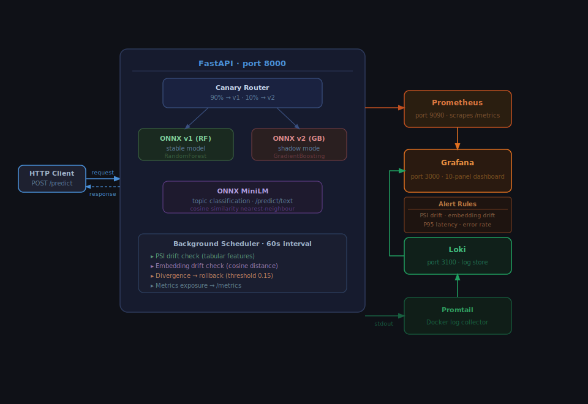
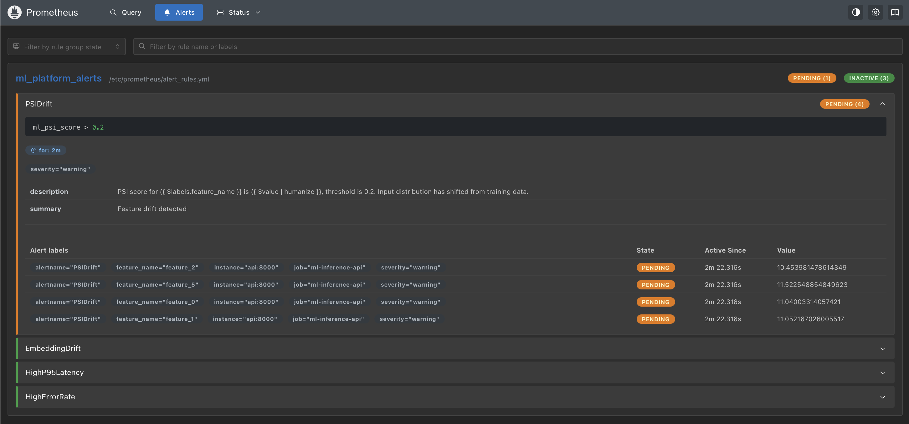
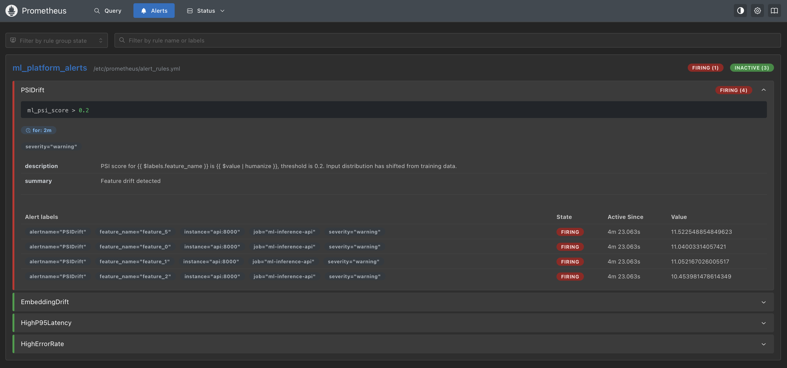
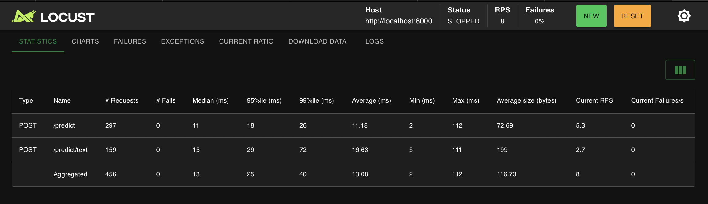
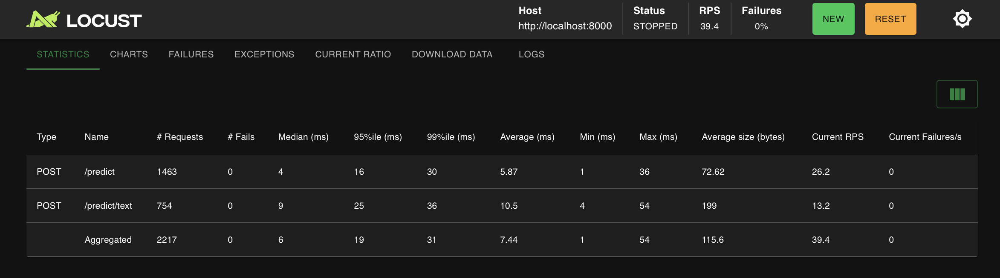
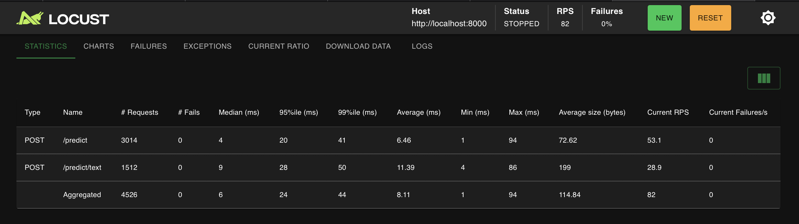
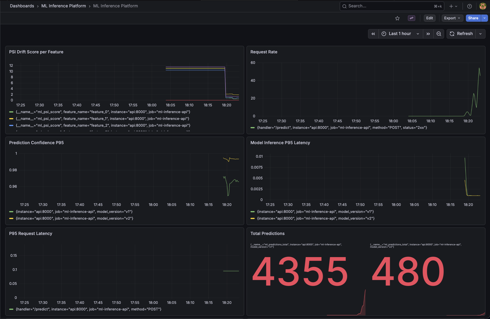
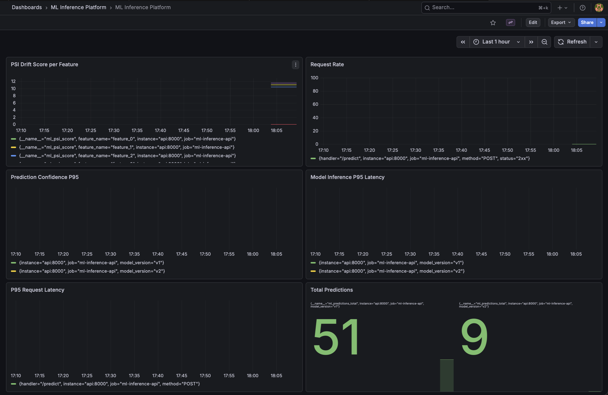
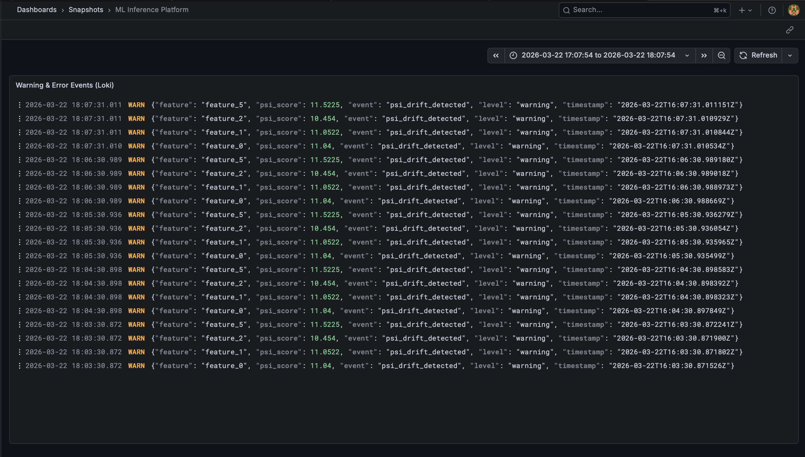

# ML Inference Platform


A production-style ML inference platform built to explore ML systems engineering. Two ONNX models are served through a FastAPI app with observability, drift detection, shadow mode testing, canary routing, and automated rollback all running locally via Docker Compose. The tabular models (RandomForest v1, GradientBoosting v2) are trained on the UCI Adult Income dataset to predict whether a person earns >$50K/year. A MiniLM embedder handles text topic classification. The main focus was the infrastructure and pipeline itself rather than the models which is why the models are simple.

---

## Table of Contents

- [Why I Built This](#why-i-built-this)
- [Architecture Overview](#architecture-overview)
- [Tech Stack](#tech-stack)
- [Services](#services)
- [Quickstart](#quickstart)
- [API Endpoints](#api-endpoints)
- [Monitoring and Observability](#monitoring-and-observability)
- [Structured Logging](#structured-logging)
- [Drift Detection](#drift-detection)
- [Shadow Mode and Canary Deployment](#shadow-mode-and-canary-deployment)
- [Alert Rules](#alert-rules)
- [Load Test Results](#load-test-results)
- [Incident Documentation](#incident-documentation)
- [Project Structure](#project-structure)
- [CI Pipeline](#ci-pipeline)
- [What I Would Change](#what-i-would-change)

---

## Why I Built This

I wanted to understand what happens to models after they're deployed. Most ML courses and tutorials stop at training and messing around with the model in a controlled environment like a Jupyter Notebook for example. This project explores the infrastructure that sits around a model in production such as how drift is detected, how risky deployments are managed safely, and how you observe a system that's making live predictions.

---

## Architecture Overview

The platform serves two inference endpoints backed by ONNX Runtime. The tabular endpoint (`/predict`) routes requests through a canary router that sends 10% of traffic to a shadow v2 model (GradientBoosting) while the remaining 90% goes to the stable v1 model (RandomForest). Both models run in the same process, loaded at startup. The text endpoint (`/predict/text`) performs topic classification using `sentence-transformers/all-MiniLM-L6-v2` exported to ONNX via HuggingFace Optimum. At startup, a 60-sentence corpus across four AG News topics (world, sports, business, sci_tech) is embedded and stored in memory. Incoming queries are embedded via mean-pooled, L2-normalised inference entirely in NumPy, then matched against the corpus by cosine similarity to return a topic label, confidence score, and matched document. Embeddings are recorded for drift monitoring.

A background scheduler runs every 60 seconds and does three things: PSI drift detection on a rolling window of tabular features against the training distribution, cosine similarity drift detection on text embeddings against a reference set built from the first 50 requests, and a rollback check that reverts canary traffic if v1/v2 prediction divergence exceeds 15%.

Prometheus scrapes `/metrics` every 15 seconds. Seven custom metrics are exposed alongside the auto-instrumented HTTP metrics from `prometheus-fastapi-instrumentator`. Grafana is provisioned automatically with a 10-panel dashboard and two datasources (Prometheus and Loki). Four alert rules cover PSI drift, embedding drift, P95 latency, and error rate. All application logs are emitted as structured JSON via structlog, collected by Promtail, and stored in Loki which makes them queryable alongside metrics in Grafana.



---

## Tech Stack

| Component | Technology |
|-----------|-----------|
| API framework | FastAPI |
| Model runtime | ONNX Runtime |
| Tabular models | scikit-learn (RandomForest, GradientBoosting) |
| Text model | sentence-transformers/all-MiniLM-L6-v2 via HuggingFace Optimum |
| Model export | skl2onnx, HuggingFace Optimum |
| Logging | structlog (JSON structured logging) |
| Log aggregation | Grafana Loki + Promtail |
| Metrics | Prometheus + prometheus-fastapi-instrumentator |
| Dashboards | Grafana (auto-provisioned) |
| Containerisation | Docker Compose |
| CI | GitHub Actions |
| Load testing | Locust |
| Testing | pytest (unit + integration) |

---

## Services

| Service | URL | Description |
|---------|-----|-------------|
| API | http://localhost:8000 | Inference endpoints |
| API Docs | http://localhost:8000/docs | Interactive Swagger UI |
| Metrics | http://localhost:8000/metrics | Raw Prometheus metrics |
| Prometheus | http://localhost:9090 | Query and alert state |
| Grafana | http://localhost:3000 | Dashboard (admin / admin) |
| Loki | http://localhost:3100 | Log aggregation backend |
| Locust | http://localhost:8089 | Load test UI (run `locust -f locust/locustfile.py --host http://localhost:8000`) |

---

## Quickstart

**Prerequisites:** Docker, Docker Compose, Python 3.10

### 1. Clone the repository

```bash
git clone https://github.com/ammarhassona/ml-inference-platform.git
cd ml-inference-platform
```

### 2. Create a virtual environment and install dependencies

**With pip:**

```bash
python -m venv .venv
source .venv/bin/activate  # Windows: .venv\Scripts\activate
pip install -r requirements.txt
```

**With uv (faster):**

```bash
curl -LsSf https://astral.sh/uv/install.sh | sh
uv sync
```

`uv sync` reads `pyproject.toml` and creates the virtual environment automatically.

### 3. Export models

These scripts train the classifiers on the UCI Adult Income dataset and export them to ONNX, then download and export MiniLM to ONNX. Run both from the project root. The `model_artifacts/` directory is gitignored and must be populated before starting the stack.

```bash
python scripts/export_model.py
python scripts/export_minilm.py
```

Expected output from `export_model.py`:

```
Random Forest Classifier Accuracy: 0.8098065308629337
Gradient Boosting Classifier Accuracy: 0.8439963148735797
```

`export_minilm.py` will download `sentence-transformers/all-MiniLM-L6-v2` from HuggingFace Hub (~90 MB) on first run.

### 4. Start the stack

```bash
docker compose up --build
```

Initial startup takes ~30 seconds while ONNX Runtime loads both models and the tokenizer.

### 5. Verify

```bash
curl http://localhost:8000/health
# {"status":"ok"}
```

---

## API Endpoints

### `GET /health`

```bash
curl http://localhost:8000/health
```

```json
{"status": "ok"}
```

---

### `POST /predict`

Tabular inference. Accepts a 6-feature float vector from the UCI Adult Income dataset: `age`, `fnlwgt`, `education_num`, `capital_gain`, `capital_loss`, `hours_per_week`. Returns the predicted income class (0 = ≤$50K, 1 = >$50K) and per-class probabilities. Each request is also run through the shadow v2 model in the background.

The dataset contains an additional 8 features (totalling to 14) which were not used in the models. The reason being that the other features are categorical features and processing and handling them would make the ONNX export more difficult. It would also require to change the API schema to accept mixed types rather than just floats. I did not see a reason to add complexity to the system given that there would not be a significant difference between using just numerical features and just all the features.

Despite the marginal improvement in terms of feature count over the Iris dataset, there are a few benefits over using the UCI Adult Income dataset:
- The distributions are more realistic
- ~49K rows vs 150 Iris rows
- The models do not score 100% accuracy on the dataset meaning features actually have a much higher chance of natural PSI drift

```bash
curl -X POST http://localhost:8000/predict \
  -H "Content-Type: application/json" \
  -d '{"features": [39.0, 77516.0, 13.0, 2174.0, 0.0, 40.0]}'
```

```json
{
  "prediction": 0,
  "probabilities": [0.82, 0.18]
}
```

---

### `POST /predict/text`

Topic classification over an in-memory corpus of 60 AG News sentences across four topics: `world`, `sports`, `business`, `sci_tech`. The query is embedded using MiniLM via mean pooling and L2 normalisation, then matched against the corpus by cosine similarity. Returns the closest topic label, confidence score, and the matched corpus sentence. Embeddings are recorded for drift monitoring. If the distribution of queries shifts (e.g. from sports to business topics), the embedding drift score rises and an alert fires.

```bash
curl -X POST http://localhost:8000/predict/text \
  -H "Content-Type: application/json" \
  -d '{"text": "NASA spacecraft docks with the space station"}'

curl -X POST http://localhost:8000/predict/text \
  -H "Content-Type: application/json" \
  -d '{"text": "Phelps won the 200 freestyle"}'

```

```json
{
  "label": "sci_tech",
  "similarity": 0.6022,
  "matched_document": "Russian Cargo Craft Docks at Space Station (AP) AP - A Russian cargo ship docked with the international space station Saturday, bringing food, water, fuel and other items to the two-man Russian-American crew, a space official said."
}


{
  "label": "sports",
  "similarity": 0.7719,
  "matched_document": "Phelps, Thorpe Advance in 200 Freestyle (AP) AP - Michael Phelps took care of qualifying for the Olympic 200-meter freestyle semifinals Sunday, and then   found out he had been added to the American team for the evening's 400 freestyle relay final. Phelps' rivals Ian Thorpe and Pieter van den Hoogenband and teammate Klete Keller were faster than the teenager in the 200 free preliminaries."
}
```

---

## Monitoring and Observability

Grafana is provisioned automatically with two datasources (Prometheus and Loki) and a 10-panel dashboard. Nothing to configure manually.

| Panel | Metric | Description |
|-------|--------|-------------|
| PSI Drift Score per Feature | `ml_psi_score` | Population Stability Index per feature, labelled by feature name. Threshold line at 0.2. |
| Request Rate | `http_requests_total` | Requests per second across all endpoints. |
| Prediction Confidence P95 | `ml_prediction_probability` | 95th percentile of max class probability. Drops indicate the model is less certain. |
| Model Inference P95 Latency | `ml_predictions_latency_seconds` | Pure ONNX inference time, excluding network and serialisation. Split by model version. |
| P95 Request Latency | `http_request_duration_seconds` | End-to-end HTTP latency at P95 across all handlers. |
| Total Predictions | `ml_predictions_total` | Cumulative prediction count, split by model version. |
| Shadow Model Divergence | `ml_shadow_divergence` | Fraction of recent requests where v1 and v2 disagreed. Rollback triggers at 0.15. |
| Embedding Drift Score | `ml_embedding_drift_score` | Mean cosine distance between current embeddings and the reference window. Threshold at 0.3. |
| Text Request Rate | `http_requests_total` | Requests per second filtered to `/predict/text`. |
| Application Logs | Loki | Live warning and error log events from the API container, queryable by level and event name. |

---

## Structured Logging

All application logs are emitted as JSON via `structlog`, making them queryable by tools like Grafana Loki, Datadog, or `jq`. Each log line includes a timestamp, level, and structured fields — no plain string messages.

| Event | Level | Key Fields |
|-------|-------|-----------|
| `rollback_triggered` | warning | `divergence`, `canary_percent_before`, `canary_percent_after` |
| `canary_restored` | info | `divergence`, `canary_percent_after` |
| `shadow_divergence_updated` | info | `divergence`, `buffer_size` |
| `shadow_inference_failed` | warning | `error` |
| `psi_drift_detected` | warning | `feature`, `psi_score` |
| `psi_check` | info | `feature`, `psi_score` |
| `embedding_reference_locked` | info | `reference_size` |
| `embedding_drift_detected` | warning | `drift_score`, `window_size` |
| `embedding_drift_check` | info | `drift_score`, `window_size` |
| `scheduler_error` | error | `error` |

Example log line:
```json
{"log_level": "warning", "timestamp": "2026-03-21T14:32:01Z", "event": "rollback_triggered", "divergence": 0.16, "canary_percent_before": 10.0, "canary_percent_after": 0}
```

To view live logs from the running container:
```bash
docker compose logs -f api
```

Logs are also ingested into Loki via Promtail and queryable in Grafana. Go to Grafana → Explore → select Loki datasource and run:

```
{container="/ml-inference-platform-api-1"} | json
```

Useful queries:
```
# warning and above only
{container="/ml-inference-platform-api-1"} | json | level="warning"

# rollback events only
{container="/ml-inference-platform-api-1"} | json | event="rollback_triggered"

# drift detections only
{container="/ml-inference-platform-api-1"} | json | event="embedding_drift_detected"

# PSI drift detections only
{container="/ml-inference-platform-api-1"} | json | event="psi_drift_detected"
```

---

## Drift Detection

### Tabular — Population Stability Index (PSI)

PSI measures how much the distribution of each input feature has shifted relative to the training distribution. Reference bin edges are calculated at startup from `reference_features.npy` (saved during model export) using quantile-based binning. On each scheduler tick (every 60 seconds), PSI is computed over a rolling window of the last 500 requests.

```
PSI = Σ (actual% − expected%) × ln(actual% / expected%)
```

| PSI value | Interpretation |
|-----------|---------------|
| < 0.1 | No significant shift |
| 0.1 – 0.2 | Moderate shift, monitor |
| > 0.2 | Significant shift — alert fires |

### Text — Cosine Similarity Drift

The first 50 text requests build a reference embedding set. Subsequent embeddings are added to a rolling window (max 200). On each scheduler tick, mean cosine similarity between every current embedding and every reference embedding is computed. Drift score is `1 − mean_similarity`, so 0 means no drift and 1 means total distributional shift.

| Drift score | Interpretation |
|-------------|---------------|
| < 0.1 | Stable |
| 0.1 – 0.3 | Gradual shift |
| > 0.3 | Alert fires |

---

## Shadow Mode and Canary Deployment

**Shadow mode:** every `/predict` request triggers a background task that runs the same features through the v2 model (GradientBoosting). The v2 result is never returned to the caller, it is only used to update the divergence metric. This lets v2 be evaluated against real production traffic with zero user impact. Async jobs (shadow inference, drift recording) are handled via FastAPI BackgroundTasks and a daemon thread scheduler.

**Canary routing:** 10% of `/predict` traffic is actively served by v2. The `get_active_model()` function draws a uniform random number; if it falls below the canary percentage, the request is served by v2 and the response is returned to the user.

**Automated rollback:** the scheduler checks `ml_shadow_divergence` on every tick. If divergence exceeds 0.15 (v1 and v2 disagree on more than 15% of recent requests) and canary is still active, `canary_percent` is set to zero and all traffic is routed to v1. The rollback event is counted in `ml_rollback_total` and logged at WARNING level. If divergence later normalises below the threshold, canary is automatically restored to 10% and logged at INFO level as `canary_restored`.

---

## Alert Rules

| Alert | Expression | For | Severity |
|-------|-----------|-----|----------|
| PSIDrift | `ml_psi_score > 0.2` | 2m | warning |
| EmbeddingDrift | `ml_embedding_drift_score > 0.3` | 2m | warning |
| HighP95Latency | `histogram_quantile(0.95, rate(http_request_duration_seconds_bucket[5m])) > 0.2` | 1m | warning |
| HighErrorRate | `rate(http_requests_total{status="5xx"}[5m]) / rate(http_requests_total[5m]) > 0.05` | 1m | critical |

Alerts were validated by injecting out-of-distribution data and observing Prometheus fire the PSIDrift alert. The alert first enters a pending state (threshold breached, waiting out the `for: 1m` duration) before transitioning to firing:




---

## Load Test Results

Load tests were run with Locust. Zero failures across all concurrency levels. Latency improves from low to medium concurrency as sustained load keeps CPU caches and the ONNX Runtime warm.

### Tabular endpoint (`/predict`)

| Users | P50 | P95 | P99 | RPS | Failures |
|-------|-----|-----|-----|-----|----------|
| 10 | 11ms | 18ms | 26ms | 5.3 | 0% |
| 50 | 4ms | 16ms | 30ms | 26.2 | 0% |
| 100 | 4ms | 20ms | 41ms | 53.1 | 0% |





### Text endpoint (`/predict/text`)

| Users | P50 | P95 | P99 | RPS | Failures |
|-------|-----|-----|-----|-----|----------|
| 10 | 15ms | 29ms | 72ms | 2.7 | 0% |
| 50 | 9ms | 25ms | 36ms | 13.2 | 0% |
| 100 | 9ms | 28ms | 50ms | 28.9 | 0% |

### Aggregated — both endpoints combined

| Users | P50 | P95 | P99 | RPS | Failures |
|-------|-----|-----|-----|-----|----------|
| 10 | 13ms | 25ms | 40ms | 8 | 0% |
| 50 | 6ms | 19ms | 31ms | 39.4 | 0% |
| 100 | 6ms | 24ms | 44ms | 82 | 0% |

The text endpoint is ~2× slower than tabular due to tokenization and the larger MiniLM graph, but well within the 200ms SLO. Latency improves from 10 to 50 users because low concurrency leaves gaps between requests, allowing CPU caches and the ONNX Runtime to go partially cold. At 50+ users the sustained load keeps everything warm, and the gains plateau slightly.

Grafana dashboard after all three load tests (~5000 requests total):



---

## Incident Documentation

A simulated data drift incident (out-of-distribution Adult Income features injected directly) as shown in the [Alert Rules](#alert-rules) section

Grafana dashboard during drift incident — PSI scores elevated across features:



Loki logs showing PSI drift warnings emitted by the scheduler:



---

## Project Structure

<details>
<summary>Expand project structure tree</summary>

```
ml-inference-platform/
├── app/
│   ├── __init__.py
│   ├── config.py              # All tunable constants (thresholds, window sizes)
│   ├── corpus.json            # AG News corpus (60 sentences across 4 topics: world, sports, business, sci_tech)
│   ├── logger.py              # structlog configuration and get_logger helper
│   ├── main.py                # FastAPI app, endpoints, scheduler
│   ├── metrics.py             # Prometheus metric definitions
│   └── services/
│       ├── __init__.py
│       ├── drift.py           # PSI computation and feature window
│       ├── embedding_drift.py # Cosine similarity drift for text
│       ├── router.py          # Canary routing and rollback logic
│       ├── shadow.py          # Shadow v2 inference and divergence tracking
│       └── topic_classification.py # Corpus embedding, nearest-neighbour topic classification
├── docs/                      # Screenshots: load tests, drift incidents, alerts
├── grafana/
│   └── provisioning/
│       ├── dashboards/        # Auto-provisioned dashboard JSON
│       └── datasources/       # Auto-provisioned Prometheus and Loki datasources
├── locust/
│   └── locustfile.py          # Load test scenarios
├── model_artifacts/           # ONNX models and reference data (gitignored)
├── prometheus/
│   ├── alert_rules.yml        # 4 alert rules
│   └── prometheus.yml         # Scrape config
├── promtail/
│   └── promtail.yml           # Promtail config — scrapes Docker logs, ships to Loki
├── scripts/
│   ├── build_corpus.py        # One-time script to build AG News corpus from HuggingFace datasets
│   ├── export_minilm.py       # Download and export MiniLM to ONNX
│   └── export_model.py        # Train and export tabular models to ONNX
├── tests/
│   ├── test_drift.py          # PSI calculation correctness tests
│   ├── test_drift_injection.py # End-to-end drift injection: reference lock → baseline → OOD shift → threshold breach
│   ├── test_embedding_drift.py # Embedding reference locking and drift score tests
│   ├── test_integration.py    # Integration tests covering all endpoints via TestClient
│   ├── test_router.py         # Canary rollback boundary condition tests
│   └── test_topic_classification.py # Nearest-neighbour topic label tests
├── .github/
│   └── workflows/
│       └── ci.yaml            # GitHub Actions CI pipeline
├── docker-compose.yml
├── Dockerfile
├── pyproject.toml
└── requirements.txt
```

</details>

---

## CI Pipeline

The project uses a GitHub Actions workflow (`.github/workflows/ci.yaml`) that runs on every push to `main`.

The pipeline:
1. Sets up Python 3.10 and installs dependencies via `uv`, with the uv package cache keyed on `requirements.txt`
2. Exports the ONNX models by running both export scripts, with the HuggingFace model download cached across runs
3. Runs the full pytest test suite — unit tests (PSI drift, rollback boundary conditions, embedding drift, topic classification, end-to-end drift injection) and integration tests (all endpoints via FastAPI TestClient) — fails fast before any Docker work if logic is broken
4. Builds the Docker image via BuildKit with layer caching, so only changed layers are rebuilt
5. Starts the full stack with `docker compose up -d` and waits for the API to be ready
6. Runs smoke tests against `/health`, `/predict`, and `/predict/text`
7. Tears down the stack unconditionally on completion

---

## What I Would Change

The tabular models use only the 6 numerical features from the UCI Adult Income dataset, dropping the 8 categorical columns (workclass, occupation, education, etc.) to keep the ONNX export simple. Adding a `ColumnTransformer` with ordinal encoding baked into the sklearn pipeline would let the model use all 14 features and improve accuracy slightly, but would require changing the API to accept a mix of float and string inputs which adds more complexity than it's worth for a single-worker demo.

Redis was initially planned to be implemented but was then removed from the final implementation. The platform uses FastAPI BackgroundTasks for shadow inference and a daemon thread scheduler for periodic drift checks which is sufficient for a single-worker deployment. Redis would become necessary when scaling to multiple API workers, where background tasks can't share in-process state. At that point, Redis would serve as a job queue (via Celery or RQ) to distribute shadow inference and drift computation across workers without race conditions.

The Prometheus alert rules are configured but have no notification channel wired up, alerts fire internally but go nowhere. In a real deployment these would route to PagerDuty, Slack, or a webhook via Alertmanager.

Grafana uses the default `admin / admin` credentials. This is fine for local development but would be replaced with environment-variable-configured credentials.

While all previous change are valid, I the next step in this project for me would be to explore how this pipeline would work with larger models such as LLMs and maybe exploring LLM hallucinations as the drift metric.